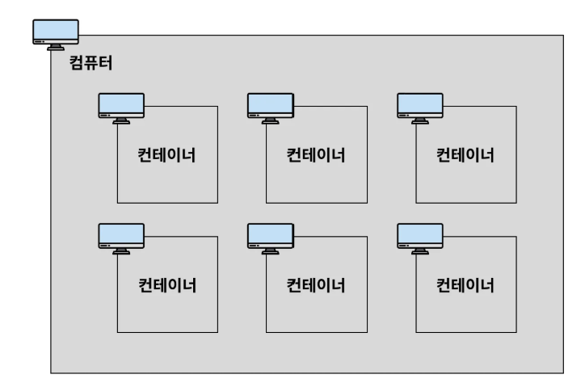
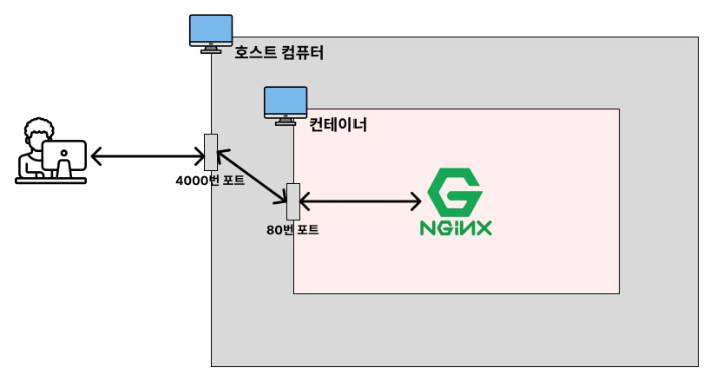
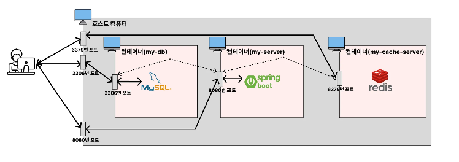
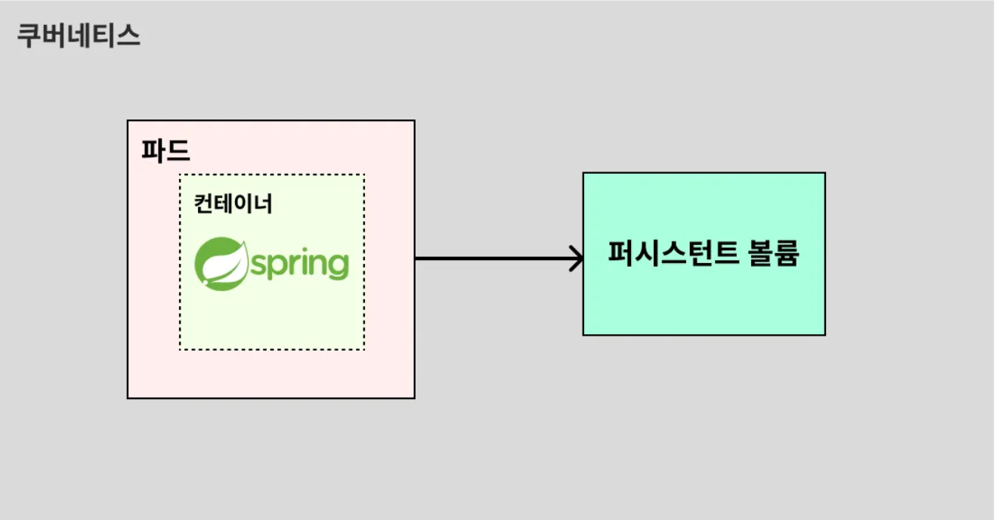
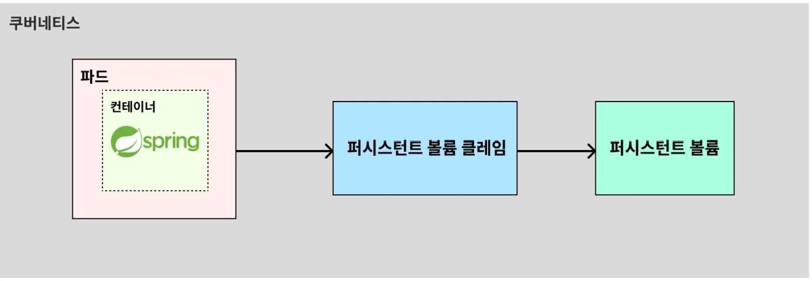
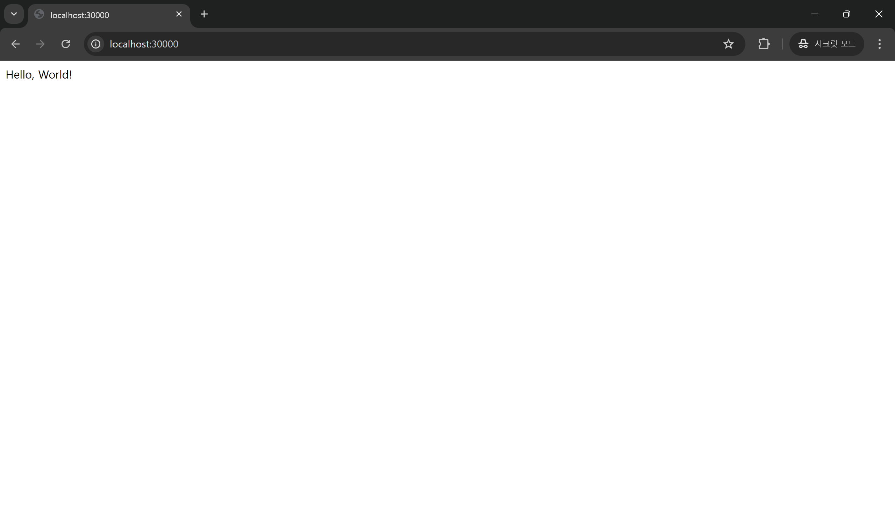
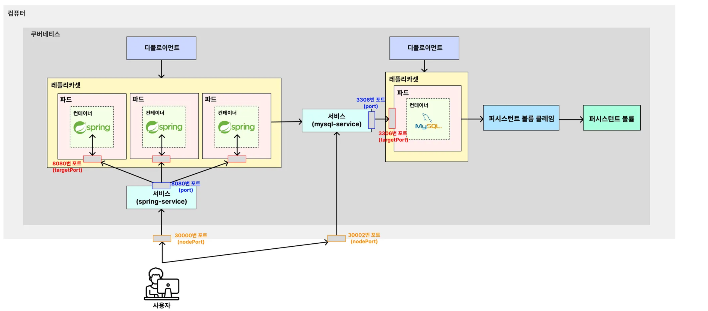

<details>
    <summary><b>2025-03-04</b></summary>

# 1. Docker란?

- 컨테이너를 사용하여 각각의 프로그램을 분리된 환경에서 실행 및 관리할 수 있는 툴이다.

# 2. Container란?

- Doker에서 컨테이너라는 개념은 아주 중요한 개념이다.
- 하나의 컴퓨터 환경 내에서 독립적인 컴퓨터 환경을 구성해서, 각 환경에 프로그램을 별도로 설치할 수 있게 만든 개념이다.
- 하나의 컴퓨터 환경 내에서 여러개의 미니 컴퓨터 환경을 구성할 수 있는 형태이다.
- 여기서 말하는 미니 컴퓨터를 Docker에서는 _컨테이너_ 라고 한다.
  

# 3. 이미지(Image)란?

- Docker에서 닌텐도 칩과 같은 역할을 하는 개념이 이미지 이다.
- 이미지란 프로그램을 실행하는데 필요한 설치 과정, 설정, 버전 정보 등을 포함하고 있다.
- 즉 프로그램을 실행하는데 필요한 모든 것을 포함하고 있다.

# 4. 최신 버전 이미지 다운로드

- 예시 nignx

```
#최신 버전 다운로드
docker pull nginx

# 특정 버전 다운로드
docker pull nginx:stable-perl
```

- 이미지 다운로드는 Dockerhub라는 곳에서 이미지를 다운로드 받는다.

# 5. 이미지 조회

```
docker image ls
```

# 6. 이미지 삭제

```
#특정 이미지 삭제
docker image rm

#중지된 컨테이너에서 사용하고 있는 이미지 강제 삭제하기
docker image rm -f 이미지 ID 또는 이미지명

# 컨테이너에서 사용하고 있지 않은 이미지만 전체 삭제
docker image rm $(docker images -q)

#컨테이너에서 사용하고 있는 이미지를 포함해서 전체 이미지 삭제
docker image rm -f $(docker images -q)
```

- docker images -q : 시스템에 있는 모든 이미지의 ID를 반환한다.
- -q는 quite를 의미하며, 상세 정보 대신에 각 이미지의 고유한 ID만 표시하도록 지시한다.

# 7. 컨테이너 생성 + 실행

```
#포그라운드에서 실행
docker run nginx

#백그라운드에서 실행
docker run -d nginx

#컨테이너에 이름 붙여서 생성 및 실행하기
docker run -d --name [컨테이너 이름] 이미지명[:태그명]
docker run -d --name my-web-server nginx
```

- 포그라운드에서는 내가 실행시킨 프로그램의 내용이 화면에서 실행되고 있어 다른 프로그램 조작을 할수가 없다.
- 백그라운드에서는 내가 실행시킨 프로그램이 컴퓨터 내부에서 실행되고 있어서 어떻게 실행되고 있는지 화면에서 확인할 수 없다.

# 8. 호스트의 포트와 컨테이너의 포트를 연결하기

```
docker run -d -p [호스트 포트]:[컨테이너 포트] 이미지명
doxker run -d -p 4000:80 nginx
```



- docker run -p 4000:80 라고 입력하게 되면, 도커를 실행하는 호스트의 4000번 포트를 컨테이너의 80번 포트로 연결하도록 설정한다.

# 9. 컨테이너 조회/중지/삭제

## 9-1. 컨테이너 조회

```
# 실행 중인 컨테이너들만 조회
docker ps

# 모든 컨테이너 조회
docker ps -a
```

## 9-2. 컨테이너 중지

```
docker stop 컨테이너명[또는 컨테이너 ID]
```

## 9-3. 컨테이너 삭제

```
#중지되어 있는 특정 컨테이너 삭제
docker rm 컨테이너명[또는 컨테이너 ID]

#실행되고 있는 특정 컨테이너 삭제
docker rm -f 컨테이너명[또는 컨테이너 ID]

#중지되어 있는 모든 컨테이너 삭제
docker rm $(docker ps -qa)

# 실행되고 있는 모든 컨테이너 삭제
docker rm -f $(docker ps -qa)
```

# 10. 컨테이너 로그 조회

```
#특정 컨테이너의 모든 로그 조회
docker run -d nginx #백그라운드 실행
docker ps -a #컨테이너 전체 조회
docker logs [nginx컨테이너 ID]

#최근 로그 ??줄만 조회
docker logs --tail [로그 끝부터 표시할 줄 수] [컨테이너  ID 또는 컨테이너 명]
docker logs --tail 10 nginx

# 기존 로그는 조회 x + 생성되는 로그를 실시간으로 보고 싶은 경우
docker logs --tail 0 -f

# 기존 로그 조회 + 생성되는 로그 실시간 조회
docker logs -f [컨테이너 ID 또는 컨테이너 명]

```

# 11. 실행 중인 컨테이너 내부에 접속하기

```
docker exec -it [컨테이너 ID 또는 컨테이너 명] bash
```

</details>

<details>
    <summary><b>2025-03-05</b></summary>

# 1. 도커 볼륨

- 도커의 볼륨(Volume)이란 도커 컨테이너에서 데이터를 영속적으로 저장하기 위한 방법이다. 볼륨(Volume)은 컨테이너 자체의 저장 공간을 사용하지 않고,호스트 자체의 저장 공간을 공유해서 사용하는 형태이다.

```
docker run -v [호스트 디렉토리 절대 경로]:[컨테이너의 디렉토리 절대 경로] [이미지명]:[태그명]
```

## MySQl 볼륨 이용해서 컨테이너 띄우기

```
#원하는 경로에 MySQL 데이터를 저장하고 싶은 폴더 만들기
mkdir docker-mysql

docker run -e MYSQL_ROOT_PASSWORD=password123 -p 3306:3306 -v [호스트 절대 경로]/mysql_data:/var/lib/mysql -d mysql
```

- 이때 주의할 점은 mysql_data 디렉토리를 미리 만들어 놓으면 안된다. 그래야 처음 이미지를 실행시킬 때 mysql 내부에 있는 /var/lib/mysql 파일들을 호스트 컴퓨터로 공유 받을 수 있다.
- 만약 mysql_data 디렉토리를 미리 만들어놓을 경우 기존 컨테이너의 파일들 전부 삭제한 뒤에 덮어씌워버린다.

## MySQL 컨테이너에 접속해서 데이터베이스 만들기

```
docker exec -it [sql컨테이너 ID] bash

mysql -u root -p

show databases;
create database mydb;
show databases;
```

# 2. Dockerfile 활용해 이미지 만들기

```
FROM openjdk:21-jdk

ENTRYPOINT ["/bin/bash", "-c", "sleep 500"]
#일단 ENTRYPOINT는 임시 디버깅용
#500초 동안 시스템을 일시정지 시키는 명령어

docker build -t my-jdk21-server .

docker run -d my-jdk21-server

docker ps #실행 중인 컨테이너 조회
docker exec -it [컨.I] bash #컨테이너 접속
java -version # jdk 설치되어 있는지 확인

```

# 3. COPY 파일 이동

```
COPY [호스트 컴퓨터에 있는 복사할 파일 경로] [컨테이너에서 파일이 위치할 경로]
```

# 4. ENTRYPOINT

- 컨테이너가 시작할 때 실행되는 명령어

```
FROM ubuntu

ENTRYPOINT ["/bin/bash", "-c", "echo hello"]
```

# 5. 스프링 도커파일 작성하기

## 5-1. 도커파일 작성하기

```
FROM openjdk:21-jdk
COPY build/libs/*SNAPSHOT.jar app.jar
ENTRYPOINT ["java","-jar","/app.jar"]
```

## 5-2. 스프링 부트 프로젝트 빌드하기

```
./gradlew clean build
```

## 5-3. dockerfile을 바탕으로 이미지 빌드하기

```
docker build -t hello-server .
```

## 5-4. 이미지 생성됐는 지 확인하기

```
docker image ls
```

## 5-5. 생성한 이미지를 컨테이너로 실행

```
docker run -d -p 8080:8080 hello-server
```

## 5-6. 확인

```
docker ps
```


# 6. RUN

- RUN은 이미지 생성 과정에서 명령어를 실행시켜야 할 때 사용한다.

```
RUN npm install
```

## RUN VS ENTRYPOINT

- RUN 명령어는 이미지 생성 과정에서 필요한 명령어를 실행시킬 때 사용한다.
- ENTRYPOINT 명령어는 생성된 이미지 기반으로 컨테이너를 생성한 직후에 명령어를 실행시킬 때 사용한다.

## WORKDIR

- 안쓰면 기존 파일들과 섞이게 된다.

```
WORKDIR /usr/src/app
```

</details>

<details>
    <summary><b>2025-03-06</b></summary>

# 1. DockerCompose

- 여러개의 Docker 컨테이너들을 하나의 서비스로 정의하고 구성해 하나의 묶음으로 관리할 수 있게 도와주는 툴이다.

- 여러개의 컨테이너로 이루어진 복잡한 애플리케이션을 한 번에 관리할 수 있게 해준다.
- 복잡한 명령어로 실행시키던 걸 간소화 시킬 수 있다.

## 1-1. mysql compose로 하는법

### compose.yml 파일 생성

```
services:
    my-db:
        image: mysql
        environment:
            MYSQL_ROOT_PASSWORD: pwd1234
        volumes:
            - ./mysql_data:/var/lib/mysql
        ports:
            -3306:3306
```

### 실행

```
docker compose up -d
docker compose ps
docker compose down
```

## 1-2. spring boot compose실행

### Dockerfile 작성

```
FROM openjdk:21-jdk
COPY build/libs/*SNAPSHOT.jar /app.jar
ENTRYPOINT ["java","-jar","/app.jar"]
```

### spring boot 빌드

```
./gradlew clean build
```

### compose.yml 작성하기

```
services:
    my-server:
        build: .
        ports:
            - 8080:8080
```

- build: . 은 compose.yml 이 존재하는 디렉토리에 있는 Dockerfile로 이미지를 생성해 컨테이너를 띄우겠다는 의미이다.

### 실행하기

```
docker compose up  -d --build
docker compose ps
docker compose down
```

# 2. spring, MYsql, redis 컨테이너 동시에 띄우기

## redis를 사용하기 전에 build.gradle에 redis 의존성 추가하기

```
implementation 'org.springframework.boot:spring-boot-starter-data-redis'
```

## application.yml

```
spring:
    datasource:
        url: jdbc:mysql://my-db:3306/mydb
        username: root
        password: pwd1234
        driver-class-name: com.mysql.cj.jdbc.Driver
    data:
        redis:
            host: my-cache-server
            port: 6379
```

## redis config작성하기

```
@Configuration
public class RedisConfig {

  @Bean
  public RedisTemplate<String, Object> redisTemplate(RedisConnectionFactory connectionFactory) {
    RedisTemplate<String, Object> template = new RedisTemplate<>();
    template.setConnectionFactory(connectionFactory);
    template.setKeySerializer(new StringRedisSerializer());
    template.setValueSerializer(new GenericJackson2JsonRedisSerializer());
    return template;
  }
}
```

## compose.yml 작성하기

```
services:
    my-server:
    builld: .
    ports:
        - 8080:8080
    depends_on:
        my-db:
            condition: service_healty
        my-cache-server:
            condition: service_healthy
    my-db:
        image: mysql
        envorinment:
            MYSQL_ROOT_PASSWORD: pwd1234
            MYSQL_DATABASE: mydb
        volumes:
            - ./mysql_data:/var/lib/mysql
        ports:
            -3306:3306
        healthcheck:
            test: [ "CMD", "mysqladmin","ping"]
            interval: 5s
            retries: 10
    my-cache-server:
        image: redis
        ports:
            - 6379:6379
        healthcheck:
            test: ["CMD","redis-cli","ping"]
            intervals: 5s
            retries: 10
```

## 실행하기

```
./gradlew clean build
docker compose up --build -d
```



</details>

<details>
    <summary><b>2025-03-07</b></summary>

# 쿠버네티스 공부

# 1. 쿠버네티스의 볼륨

- 볼륨(Volume)이란 데이터를 영속적으로 저장하기 위한 방법이다.
- 쿠버네티스에서 볼륨은 크게 2가지로 나뉜다.

## 로컬 볼륨

- 파드 내부의 공간 일부를 볼륨으로 활용하는 방식이다.
- 이 방식은 파드가 삭제되는 즉시 데이터도 함께 삭제된다.
- 그래서 실제로 사용되는 일이 잘 없다.
  

## 퍼시스턴트 볼륨(Persistent Volume, PV)

- 파드 외부의 공간 일부를 볼륨(Volume)으로 활용하는 방식이다.
- 이 방식은 피드가 삭제되는 것과 상관없이 데이터를 영구적으로 사용할 수 있다는 장점이 있다.
- 현업에서는 주로 이 방식을 많이 활용한다.
  

- 하지만 실제로 파드가 퍼시스턴트 볼륨에 직접 연결할 수 없다.
- **퍼시스턴트 볼륨 클레임** 이라는 중개자가 있어야 한다.
  그래서 쿠버네티스 구조에서는 아래와 같은 구조로 퍼시스턴트 볼륨을 연결한다.
  

# 볼륨 이용해서 mysql이랑 spring 띄우기

## 준비물: 이제 막 생성한 spring 프로젝트 2개

### mysql전용 spring

**mysql-deployment.yaml** 메이페스 파일 생성하기

```
apiVersion: apps/v1
kind: Deployment

# Deployment 기본 정보
metadata:
  name: mysql-deployment # Deployment 이름

# Deployment 세부 정보
spec:
  replicas: 1 # 생성할 파드의 복제본 개수
  selector:
    matchLabels:
      app: mysql-db # 아래에서 정의한 Pod 중 'app: backend-app'이라는 값을 가진 파드를 선택

  # 배포할 Pod 정의
  template:
    metadata:
      labels: # 레이블 (= 카테고리)
        app: mysql-db
    spec:
      containers:
        - name: mysql-container # 컨테이너 이름
          image: mysql # 컨테이너를 생성할 때 사용할 이미지
          ports:
            - containerPort: 3306  # 컨테이너에서 사용하는 포트를 명시적으로 표현
          env:
            - name: MYSQL_ROOT_PASSWORD
              valueFrom:
                secretKeyRef:
                  name: mysql-secret
                  key: mysql-root-password
            - name: MYSQL_DATABASE
              valueFrom:
                configMapKeyRef:
                  name: mysql-config
                  key: mysql-database
          # 컨테이너 내에서 어떤 경로를 볼륨으로 사용할 지 지정
          volumeMounts:
	          - name: mysql-persistent-storage # 밑에서 설정할 volumes.name과 값이 같아야 함
	            mountPath: /var/lib/mysql # mysql 컨테이너 내부에 있는 경로
      # 파드가 사용할 볼륨을 지정
      volumes:
	      - name: mysql-persistent-storage # 위에서 설정할 volumeMounts.name과 일치해야 함
	        persistentVolumeClaim:
	          claimName: mysql-pvc # 연결시킬 PVC의 name과 동일해야 함
```

**mysql-secret.yaml**

```
apiVersion: v1
kind: Secret

# Secret 기본 정보
metadata:
  name: mysql-secret # Secret 이름

# Key, Value 형식으로 값 저장
stringData:
  mysql-root-password: password123
```

**mysql-config.yaml**

```
apiVersion: v1
kind: ConfigMap

# ConfigMap 기본 정보
metadata:
  name: mysql-config # ConfigMap 이름

# Key, Value 형식으로 설정값 저장
data:
  mysql-database: kub-practice
```

**mysql-service.yaml**

```
apiVersion: v1
kind: Service

# Service 기본 정보
metadata:
  name: mysql-service # Service 이름

# Service 세부 정보
spec:
  type: NodePort # Service의 종류
  selector:
    app: mysql-db # 실행되고 있는 파드 중 'app: mysql-db'이라는 값을 가진 파드와 서비스를 연결
  ports:
    - protocol: TCP # 서비스에 접속하기 위한 프로토콜
      port: 3306 # 쿠버네티스 내부에서 Service에 접속하기 위한 포트 번호
      targetPort: 3306 # 매핑하기 위한 파드의 포트 번호
      nodePort: 30002 # 외부에서 사용자들이 접근하게 될 포트 번호
```

**mysql-pv.yaml**

```
apiVersion: v1
kind: PersistentVolume

# PersistentVolume 기본 정보
metadata:
  name: mysql-pv # PersistentVolume 이름

# PersistentVolume 세부 정보
spec:
  storageClassName: my-storage # PV와 PVC의 storageClassName이 같다면 볼륨이 연결된다.
  capacity:
    storage: 1Gi # 볼륨이 사용할 용량을 설정
  accessModes:
    - ReadWriteOnce # 아래 hostPath 타입 활용 시 이 옵션만 사용 가능
  hostPath: # hostPath 타입을 활용 (hostPath : 쿠버네티스 내부 공간을 활용)
    path: "/mnt/data" # 쿠버네티스 내부의 공간에서 /mnt/data의 경로를 볼륨으로 사용
```

**mysql-pvc.yaml**

```
apiVersion: v1
kind: PersistentVolumeClaim

# PersistentVolumeClaim 기본 정보
metadata:
  name: mysql-pvc # PersistentVolumeClaim 이름

# PersistentVolumeClaim 세부 정보
spec:
  storageClassName: my-storage # PV와 PVC의 storageClassName이 같다면 볼륨이 연결된다.
  accessModes:
    - ReadWriteOnce # 볼륨에 접근할 때의 권한
  resources: # PVC가 PV에 요청하는 리소스의 양을 정의
    requests: # 필요한 최소 리소스
      storage: 1Gi # PVC가 PV에 요청하는 스토리지 양 (PV가 최소 1Gi 이상은 되어야 한다.)
```

**메니페스트 기반으로 오브젝트 생성하기**

```
$ kubectl apply -f mysql-secret.yaml
$ kubectl apply -f mysql-config.yaml
$ kubectl apply -f mysql-deployment.yaml
$ kubectl apply -f mysql-service.yaml
```

---

## 다른 스프링 프로젝트 파일에서 실행

**테스트용 Controller 작성**

```
@RestController
public class AppController {
  @GetMapping("/")
  public String home() {
    return "Hello, World!";
  }
}
```

**application.yml**

```
spring:
  datasource:
    url: jdbc:mysql://${DB_HOST}:${DB_PORT}/${DB_NAME}
    username: ${DB_USERNAME}
    password: ${DB_PASSWORD}
    driver-class-name: com.mysql.cj.jdbc.Driver
```

**Dockerfile파일 생성**

```
FROM openjdk:21-jdk

COPY build/libs/*SNAPSHOT.jar /app.jar

ENTRYPOINT ["java", "-jar", "/app.jar"]
```

**프로젝트, 이미지 빌드하기**

```
./gradlew clean build
docker build -t spring-server .
```

**spring-deployment.yaml**

```
apiVersion: apps/v1
kind: Deployment

# Deployment 기본 정보
metadata:
  name: spring-deployment # Deployment 이름

# Deployment 세부 정보
spec:
  replicas: 3 # 생성할 파드의 복제본 개수
  selector:
    matchLabels:
      app: backend-app # 아래에서 정의한 Pod 중 'app: backend-app'이라는 값을 가진 파드를 선택

  # 배포할 Pod 정의
  template:
    metadata:
      labels: # 레이블 (= 카테고리)
        app: backend-app
    spec:
      containers:
        - name: spring-container # 컨테이너 이름
          image: spring-server # 컨테이너를 생성할 때 사용할 이미지
          imagePullPolicy: IfNotPresent # 로컬에서 이미지를 먼저 가져온다. 없으면 레지스트리에서 가져온다.
          ports:
            - containerPort: 8080  # 컨테이너에서 사용하는 포트를 명시적으로 표현
          env:
            - name: DB_HOST
              value: mysql-service # Service의 name만 입력하면 다른 서비스와 통신할 수 있다.
            - name: DB_PORT
              value: "3306" # 숫자값을 문자로 인식하게 만들기 위해 쌍따옴표 붙여야 한다.
            - name: DB_NAME
              value: kub-practice
            - name: DB_USERNAME
              value: root
            - name: DB_PASSWORD
              value: password123
```

**spring-service.yaml**

```
apiVersion: v1
kind: Service

# Service 기본 정보
metadata:
  name: spring-service

# Service 세부 정보
spec:
  type: NodePort # Service의 종류
  selector:
    app: backend-app # 실행되고 있는 파드 중 'app: backend-app'이라는 값을 가진 파드와 서비스를 연결
  ports:
    - protocol: TCP # 서비스에 접속하기 위한 프로토콜
      port: 8080 # 쿠버네티스 내부에서 Service에 접속하기 위한 포트 번호
      targetPort: 8080 # 매핑하기 위한 파드의 포트 번호
      nodePort: 30000 # 외부에서 사용자들이 접근하게 될 포트 번호
```

**매니페스트 파일 실행하기**

```
$ kubectl apply -f spring-deployment.yaml
$ kubectl apply -f spring-service.yaml
```

**결과**


**아키텍쳐**


</details>
