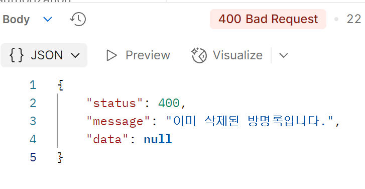

# 2025-03-17 월요일

## common-module 도입
### 1. 공통 dto
```
@Getter
@Builder
public class ResponseDto<T> {
    private int status;
    private String message;
    private T data;

    public static <T> ResponseDto<T> success(int status, String message) {
        return ResponseDto.<T>builder()
                .status(status)
                .message(message)
                .build();
    }

    public static <T> ResponseDto<T> success(int status, String message, T data) {
        return ResponseDto.<T>builder()
                .status(status)
                .message(message)
                .data(data)
                .build();
    }

    public static ResponseDto<Void> error(int status, String message) {
        return ResponseDto.<Void>builder()
                .status(status)
                .message(message)
                .build();
    }
}
```

### 2. custom exception
```
public class CustomException extends RuntimeException {
    public CustomException(String message) {
        super(message);
    }
}
```

### 3. global exception handler
```
@RestControllerAdvice
public class GlobalExceptionHandler {

    @ExceptionHandler(CustomException.class)
    public ResponseEntity<ResponseDto<Void>> handleCustomException(CustomException ex) {
        return ResponseEntity.status(400).body(ResponseDto.error(400, ex.getMessage()));
    }

    @ExceptionHandler(Exception.class)
    public ResponseEntity<ResponseDto<Void>> handleGenericException(Exception e) {
        return ResponseEntity.status(500).body(ResponseDto.error(500, "서버 오류가 발생했습니다."));
    }
}
```

- common-module의 기능들을 사용하기 위해서는 다른 서비스의 pom.xml에 추가하고, import하여여 사용해야 한다.
- common-module에서 mvn install을 진행하면 C:\Users\SSAFY\.m2\repository\com\c202\common-module 이 생긴 것을 확인할 수 있다.
- 이처럼 로컬에 jar 파일이 저장이 되어야 다른 서비스에서 이 파일을 참조해서 사용할 수 있다.
- 서버 배포시에는 외부의 repository를 사용할지도 ..?

- exception는 다른 서비스에서 custom exception으로 감싸 globalexceptionhandler에서 처리할 수 있다.
- 이는 사용자가 데이터베이스 문제나 서버의 문제를 로그를 통해 알 수 있으면 안되기 때문에 캡슐화하는 것으로 볼 수 있다.

# 2025-03-18 화요일

## 방명록 서비스 도입
### 방명록 기능
- 방명록 목록 조회(자신)
- 방명록 목록 조회(타인)
- 방명록 삭제
- 방명록 추가

### 쿼리 최적화
- 기존에 isDelted = N을 먼저 조회한 후 ownerSeq를 찾는 방식에서, ownerSeq와 isDeleted를 동시에 조건으로 추가하여 더 효율적으로 쿼리로 개선하였다.
- `List<Guestbook> guestbooks = guestbookRepository.findByOwnerSeqAndIsDeleted(ownerSeq, "N");`

## lombok 버전 충돌 해결
- 각각의 프로젝트에서 lombok 버전이 혼용되어 `C:\Users\SSAFY\.m2\repository\org\projectlombok`을 확인해보니 unknown이 존재하고 다양한 버전이 있는 것을 확인하였다.
- 1.18.36 버전만 남기고 모두 삭제하고, 모든 프로젝트의 pom.xml에서 lombok 버전을 명시하였다.

## SecurityConfig 설정
- common-module에서 securityConfig를 추가하여 각 프로젝트에서 발생하던 401 오류를 해결하였다.
- global filter와 jwt filter가 존재하더라도, spring boot 내에서 기본적으로 security를 제공하기 때문에 각 프로젝트마다 필요한 config였다.
- 이를 common-module에서 구성하여 중복되는 코드를 줄일 수 있다.

### `@ComponentScan(basePackages = {"com.c202.*"})`
- 이를 application에서 추가해주어야 common-module의 @@RestControllerAdvice를 읽을 수 있다.
- 이에 프론트앤드가 편하게 디버그를 할 수 있다.


## 에러 처리
```
// 1. 방명록이 없을 때
        Guestbook guestbook = guestbookRepository.findByGuestbookSeq(guestbookSeq);
        if (guestbook == null) {
            throw new CustomException("해당 방명록을 찾을 수 없습니다.");
        }

        // 2. 방명록이 이미 삭제된 상태인 경우
        if ("Y".equals(guestbook.getIsDeleted())) {
            throw new CustomException("이미 삭제된 방명록입니다.");
        }

        // 3. userSeq와 방명록의 writerSeq가 다른 경우
        if (!guestbook.getWriterSeq().equals(userSeq)) {
            throw new CustomException("방명록 삭제 권한이 없습니다.");
        }
```
- 에러를 세분화하여 좀 더 명확한 오류 메시지를 전달할 수 있도록 했다.

# 2025-03-19 수수요일

## 
